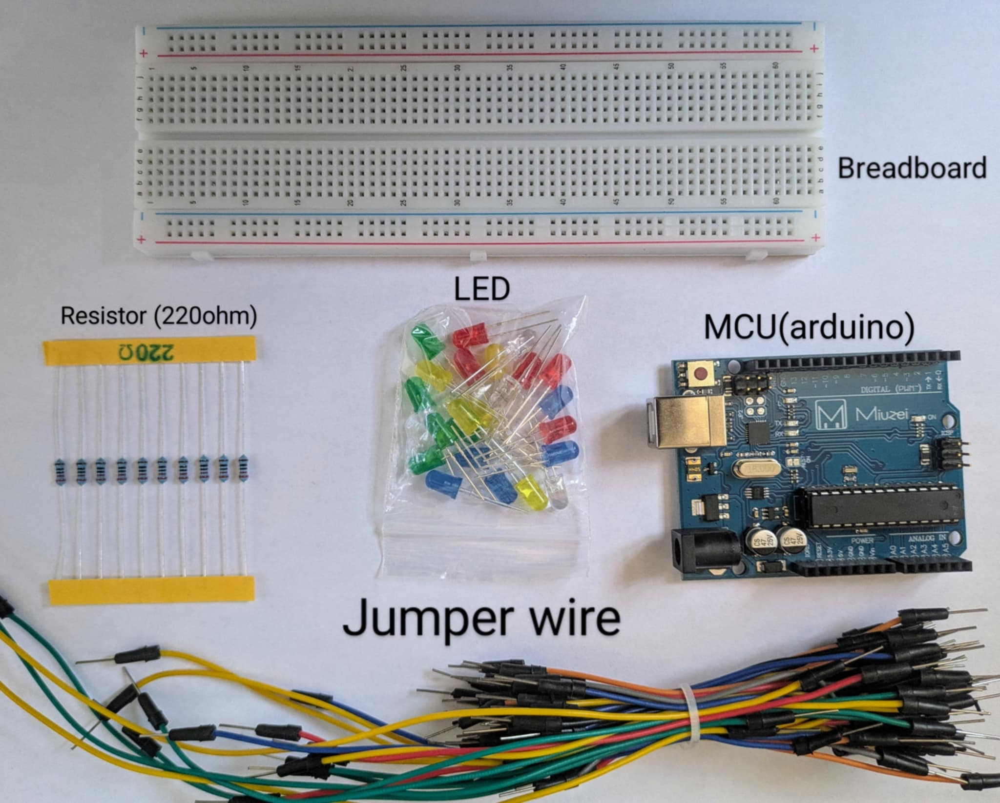
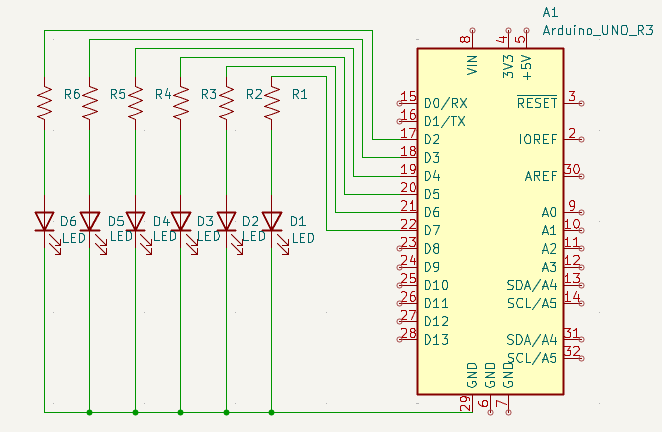

# LED-Trailing-Effect  
## Trailing LED Animation – "Control, Timing, and Precision"

The second step in my embedded journey. This isn’t just a blink anymore—this is **timed LED movement**. Like a digital ripple through hardware. It’s a simple visual effect, but behind it lies the mastery of timing, loops, and microcontroller I/O control.

---

## 🧭 Why This Matters

I’m not here to make flashy demos—I’m here to master the foundations. This LED trail effect is my second milestone. It’s about controlling multiple outputs in sequence with precision. This is what separates button mashers from embedded engineers.

### ⚙️ What I Learned This Time

- `for()` loops = cleaner pin initialization  
- Timing is everything—too fast? Unreadable. Too slow? Feels dead.  
- Hardware listens, but only if the code commands clearly  

---

## 🔩 Parts I Used 12345



---

## 📈 Schematics



---

## 🛠️ Wiring It Up


---

## 👨‍💻 The Code Behind the Magic


```cpp
int BASE = 2;
int NUM = 6;

void setup() {
  for (int i = BASE; i < BASE + NUM; i++) {
    pinMode(i, OUTPUT); // Set pins as output
  }
}

void loop() {
  for (int i = BASE; i < BASE + NUM; i++) {
    digitalWrite(i, LOW);
    delay(200);
  }
  for (int i = BASE; i < BASE + NUM; i++) {
    digitalWrite(i, HIGH);
    delay(200);
  }
}
```
---

## 🧠 The Concept
Each LED lights up in order—like a moving wave. It’s a primitive chase effect. This type of animation is found everywhere: from Knight Rider lights to marquee signs to low-level signal debugging. What matters here is the loop logic and hardware interaction.

---

🎬 Final Result

When those LEDs chased each other across the board, I didn’t just see lights—I saw timing control, loop discipline, and the start of real animation.


🎥 **Watch the Full Project Video on YouTube:**  
👉 [https://youtu.be/5EFMQ1mS4hI](https://youtu.be/5EFMQ1mS4hI)

---


## 💬 Final Thoughts
This is more than wiring and more than code—this is grit in action.
You want to learn embedded systems? You’ve got to build with your hands and debug with your brain. Start with one LED. Then make them dance. That’s how you earn it.
